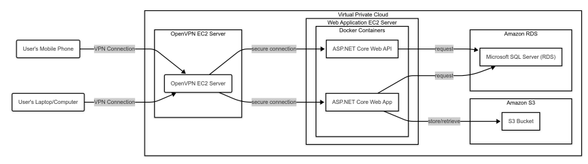
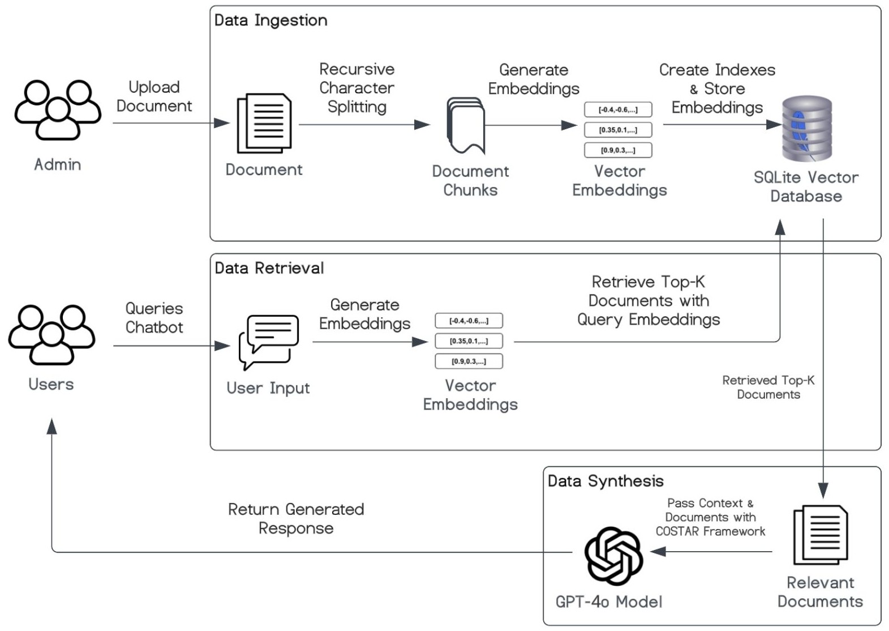
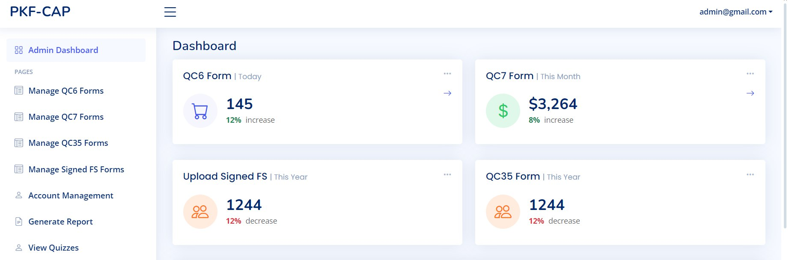
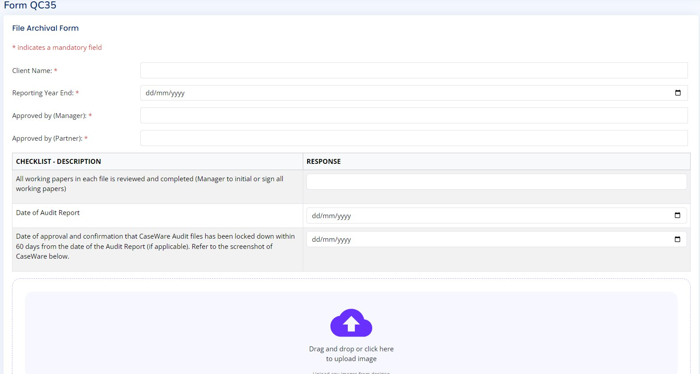
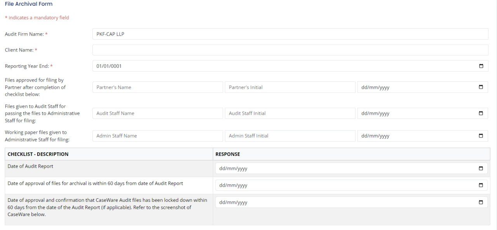
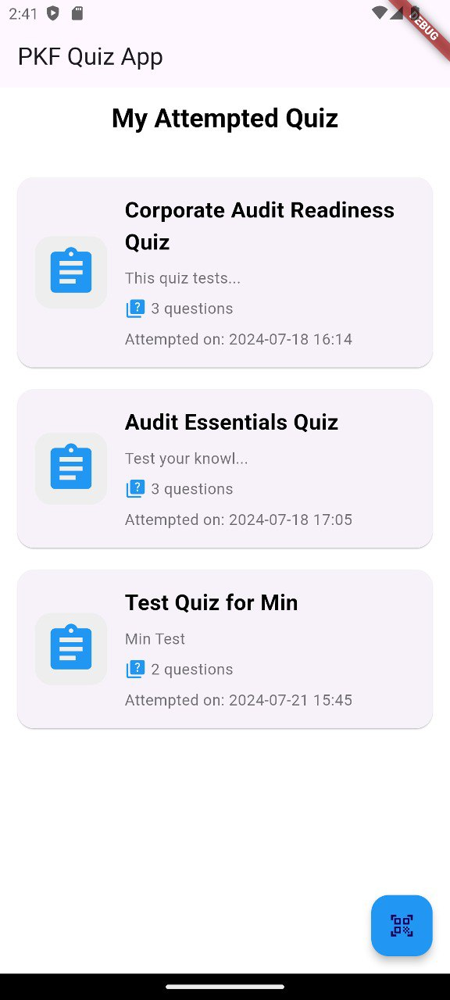

<!-- PROJECT LOGO -->
 

  </a>

  
# Audit Engagement & Staff Training Monitoring System with a RAG-Powered Knowledge Assistant

<h3 align="center">Integrative Team Project · Singapore Institute of Technology × PKF-CAP LLP · 2024</h3>

### Built With

![HTML5][HTML5-url]
![CSS3][CSS3-url]
![Javascript][Javascript-url]
[![Bootstrap][Bootstrap.com]][Bootstrap-url]
[![JQuery][JQuery.com]][JQuery-url]

📄 **Published research:** [*"Digitalisation in Audit: Development of Systems for Engagement, Training Monitoring, and a RAG-Augmented Chatbot"*](https://ieeexplore.ieee.org/document/11396238/figures#figures), IEEE SOLI 2024.

🖼️ [Project Poster](docs/ITP_Poster.jpg)

---
 
> **A note on scope:** This repo contains the **Phase 1** codebase for ASP.NET Core web application and API for audit engagement monitoring. **Phase 2** (the RAG chatbot, described below and in the linked IEEE paper) was built directly against the client's live document set and infrastructure, so that code isn't included here out of client confidentiality. The architecture, pipeline design, and results are documented in full in the paper and poster linked above.
 
---

## Overview
 
An accounting firm's engagement and training processes were run through email chains, static Word forms, and spreadsheets leading to lost details, delayed approvals, and heavy senior-staff time spent answering repeat questions from junior auditors.
 
We built and shipped a two-part digitalisation solution for a real audit firm client, replacing manual document chasing with a structured digital workflow, and layering a Retrieval-Augmented Generation (RAG) chatbot on top so staff could query firm knowledge instantly instead of interrupting senior colleagues.
 
The system was developed over two phases using a rapid-prototyping methodology with two-week client feedback cycles, and the RAG chatbot component was subsequently written up and published at **IEEE SOLI 2024**.
 
## What It Does
 
| Module | Purpose | In this repo? |
|---|---|---|
| **Web App — Audit Engagement Monitoring** | Digitises engagement/client acceptance forms, tracks manpower hours, monitors engagement status end-to-end, sends automated email reminders, and archives completed engagements. | ✅ Yes |
| **Mobile App — Staff Training Monitoring** | Lets staff register attendance, take post-course quizzes, and submit feedback/self-assessments, with results exportable for analysis. | ✅ Yes |
| **RAG Chatbot** | Answers audit-domain questions grounded in the firm's own uploaded documents, with source citations, so answers are traceable instead of hallucinated. | 📄 Documented only — see paper/poster |
 
## Architecture
 
The system runs as two containerised ASP.NET Core services (web app + API) behind an OpenVPN gateway inside an AWS VPC, backed by RDS (SQL Server) for structured data and S3 for file storage.

  
   
  <i>Figure 1: System Architecture Diagram</i>

**Why this stack:** given the sensitivity of client accounting data, the VPC + VPN boundary was a hard requirement from the client, not a default choice. Access to the internal network is restricted to authenticated VPN connections only.
 
### RAG Pipeline *(Phase 2 — design documented in the IEEE paper; implementation not included in this repo)*
 
Documents uploaded by admins are chunked (recursive character splitting), embedded with OpenAI's `text-embedding-3-small`, and indexed in a vector store. User queries are embedded the same way, matched via top-k similarity search, and the retrieved chunks are passed to GPT-4o alongside a **COSTAR-structured prompt** (Context, Objective, Style, Tone, Audience, Response) to keep answers grounded, on-domain, and citation-backed.

  
   
  <i>Figure 2: RAG Pipeline Diagram</i>

 
Iterating on real user feedback, we added conversation history awareness (so follow-up questions work without restating context) and inline citations pointing to the source document/section, both of which were gaps identified during a pilot deployment with actual audit staff.
 
## Tech Stack
 
**In this repo:**
- **Web:** ASP.NET Core MVC, ASP.NET Core Web API, Bootstrap, jQuery
- **Mobile:** Flutter (cross-platform iOS/Android)
- **Data:** Microsoft SQL Server (Amazon RDS)
- **Infra:** Docker, AWS (EC2, VPC, RDS, S3), OpenVPN

**Phase 2 (documented, not in repo):**
- **AI/RAG:** OpenAI API (GPT-4o, text-embedding-3-small), LangChain, SQLite (vector store)

## My Contribution
 
**Phase 1 (visible in this repo):**
- [x] Built the audit engagement forms module (QC 35 controller/views)
- [x] Owned the AWS deployment (S3 setup, Docker containerization)
- [x] Implemented the status-tracking & approval workflow and email notifications

**Phase 2 (documented in the IEEE paper, not in this repo):**
- [x] Designed and implemented the RAG retrieval pipeline (chunking, embeddings, top-k retrieval)
- [x] Built the chatbot management interface for admins to update the knowledge base
- [x] Co-authored the IEEE paper section detailing the RAG-augmented Chatbot implementation & evaluation.

## Screenshots

*Figure 3: Dashboard*

*Figure 4: QC 35 Form*

*Figure 5: File Archival Form*

  
   
  <i>Figure 6: Mobile Quiz Dashboard</i>

## Results & Status
 
The audit engagement system completed its initial AWS deployment and was in active use for pilot feedback with the client firm. The chatbot was independently evaluated by an accounting-trained team for accuracy and domain relevance. The mobile training app was in final release prep for the App Store / Google Play at time of writing. Both systems underwent security review before rollout.
 
## Team
 
Developed in collaboration with PKF-CAP LLP under academic supervision from SIT.
 
1. Russel Poon Wei Quan
2. Reness Ravichandran
3. Khoo Jun Wei
4. Tan Jin Hao
5. Hoe Jessaryn

<!-- MARKDOWN LINKS & IMAGES -->
<!-- https://www.markdownguide.org/basic-syntax/#reference-style-links -->
[Javascript-url]: https://img.shields.io/badge/JavaScript-323330?style=for-the-badge&logo=javascript&logoColor=F7DF1E
[HTML5-url]: https://img.shields.io/badge/HTML5-E34F26?style=for-the-badge&logo=html5&logoColor=white
[CSS3-url]: https://img.shields.io/badge/CSS3-1572B6?style=for-the-badge&logo=css3&logoColor=white
[Bootstrap.com]: https://img.shields.io/badge/Bootstrap-563D7C?style=for-the-badge&logo=bootstrap&logoColor=white
[Bootstrap-url]: https://getbootstrap.com
[JQuery.com]: https://img.shields.io/badge/jQuery-0769AD?style=for-the-badge&logo=jquery&logoColor=white
[JQuery-url]: https://jquery.com 

